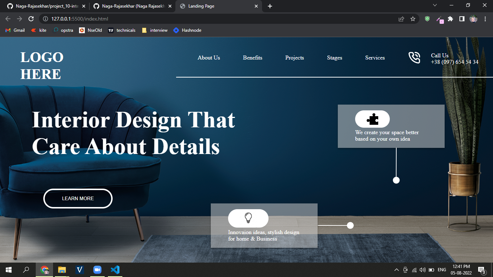

# Project 1 - HTML  and CSS 

> 
>
> By Naga Rajasekhar

You can find the live deployment link of this web page here --> **[#](#)**
 
 
 
 

 

### Learnings from completing this project

1. Gained knowledge about postions and its properties 
2. Learnt how to use svg's for proper styling
3. Gained knowledge about padding, margin, colors, border and their values
